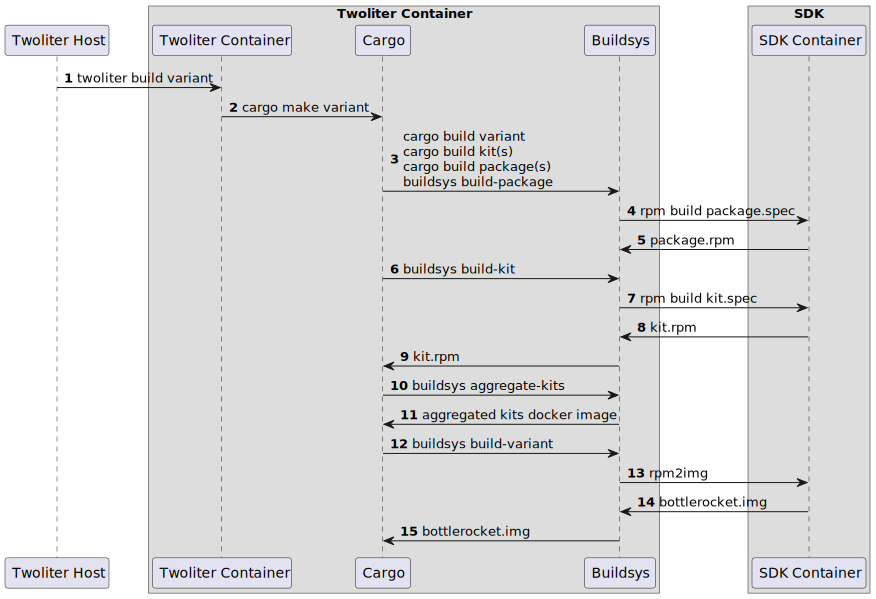

# Twoliter Design Document

## Introduction

Twoliter is a command line tool for building, testing, and deploying custom variants of [Bottlerocket](https://github.com/bottlerocket-os/bottlerocket).

### Background

One of Bottlerocket's security features is its immutable root filesystem.
Because software cannot be installed on Bottlerocket after the image has been created, it lacks a traditional package manager.
Bottlerocket *variants* allow for different software and settings to be defined in Bottlerocket at build time.
This improves security by ensuring that only the minimum software is installed to support a specific use case.

Currently, a variant is defined by adding it to the `variants` directory in the Bottlerocket git repository.
We call this *in-tree*, meaning that a variant can only be defined within Bottlerocket's git tree.
Similarly, to add software to a Bottlerocket variant, you need add it to the in-tree `packages` directory.

The fundamental goal of variants is to support customizing Bottlerocket for different use cases.
However, doing so currently requires forking and altering the Bottlerocket git repo.
To stay up-to-date with core project would require frequent rebasing with high potential for conflicting changes in the core project.

This document describes `twoliter`, a tool that will allow for the definition of a Bottlerocket variant externally from the main Bottlerocket project's git tree.

### Glossary

Here are a few of the terms we will use in this document:

- **In-Tree**: Anything that exists in, or is defined by, the [main Bottlerocket git repository]
- **Out-of-Tree Build (OOTB)**: User-customized builds of Bottlerocket defined by an external git repository owned by the user.
- **Out-of-Tree Variants**: Synonymous with *Out of Tree Builds*.
- **Maintainer**: A person who creates Bottlerocket variants using Twoliter.
- **Kit**: A container image with RPM packages in it.

[main Bottlerocket git repository]: https://github.com/bottlerocket-os/bottlerocket

### Requirements

The `twoliter` build tool should meet the following requirements.

1. Binaries and metadata published for consumption by out-of-tree builds must be signed and automatically verified.
   (TODO - #5 for refinement.)
2. Out-of-tree builds must support generating license attribution documents.
3. All functionality necessary to build, test, and publish out-of-tree builds must be provided by a unified CLI.
4. Maintainers must be able to define their own packages.
5. Maintainers must be able to mix and match core project packages with their own.
6. Maintainers must be able to replace a core project package with their own.
7. Maintainers must be able to opt out of certain Bottlerocket subsystems by choosing not to install them.
   (For example `host-ctr` and the update system are subsystems that some users will not want)
8. Maintainers must be able to use core project packages without building them.
9. Maintainers must be able to take and use packages from multiple sources.
10. Maintainers must bring their own keys for all signing operations.
11. Maintainers must be free to choose their own version numbering scheme.
12. Maintainers must have a simple mechanism that can be used to update Bottlerocket dependencies to newer versions.
13. Maintainers must be able to host their own copies of any required container images or source archives.
14. Maintainers must be able to specify their own partition layouts.

Credits:
- @jfbette: Requirement 14

### Existing Build System

It will be helpful to understand how the existing build system works.
The best way to learn this is to read the blog post *[How the Bottlerocket build system works]*.

Briefly, the entry point of the existing build system is Rust's build system, `cargo`.
A plugin called [cargo make] gets its instructions from `Makefile.toml`.
We use `cargo` to resolve dependencies between variants and packages, and we use custom build scripts to launch docker-hosted build environments.
Packages are defined and built using RPM.

These package builds take place in a docker environment using `docker build` commands with the `BuildKit` backend.
The toolchains used to compile Rust, C, C++ and Go software are distributed in a container image called the [bottlerocket-sdk].
The SDK contains cross-compiling toolchains for all supported architectures.
Currently, x86_64 and aarch64 are supported.
It is in the SDK environment that the package builds take place.

Once all the software for a Bottlerocket image has been built into RPM images, a final image creation step occurs.
A `docker build` command installs everything into an image file.

The build host has the following requirements: sufficient versions of Docker, buildx, Cargo, Cargo Make and a few tools like lz4.
The root of the Bottlerocket git repo is mounted and artifacts are created in `.cargo` and `build` directories.

Certain custom tools for building, testing and publishing Bottlerocket ([buildsys], [pubsys], and [testsys]) are compiled from source during a Bottlerocket build.
These are built using the host-installed Rust toolchain (not the SDK toolchain).
Once these are built, they are used elsewhere in the build process.
Buildsys, for example, is the tool that launches container build environments from `build.rs` scripts.

[How the Bottlerocket build system works]: https://aws.amazon.com/blogs/opensource/how-the-bottlerocket-build-system-works/
[cargo make]: https://github.com/sagiegurari/cargo-make
[bottlerocket-sdk]: https://github.com/bottlerocket-os/bottlerocket-sdk
[buildsys]: https://github.com/bottlerocket-os/bottlerocket/blob/3af909865c4da765f4afc787aaf5f50eea5c3989/tools/buildsys/Cargo.toml#L2
[pubsys]: https://github.com/bottlerocket-os/bottlerocket/blob/3af909865c4da765f4afc787aaf5f50eea5c3989/tools/pubsys/Cargo.toml#L2
[testsys]: https://github.com/bottlerocket-os/bottlerocket/blob/3af909865c4da765f4afc787aaf5f50eea5c3989/tools/testsys/Cargo.toml#L2

### Enhancing the Build System

The existing build system will remain intact with certain features and abstractions added to it.
Twoliter will serve as a facade providing a new interface over the existing build system.
Twoliter will understand how to start a Bottlerocket build using the OOTB user's sources, packages etc.
It will inject these directories into the existing build system by setting existing and new `Makefile.toml` variables.

Twoliter will eliminate the need for all build-host software other than `docker`.

## Kits

A central idea in this design is that the build system will be able to produce and consume Docker images that contain RPM packages.
We call these images *kits*.
A kit is a Yum repo distributed in its entirety, atomically, as a container image.

Maintainers may reference these kits in order to add packages to their Bottlerocket variants.
In particular, the core project will publish all of its packages in a suite of kits.
With these, an out-of-tree maintainer will have all the packages available that go into variants that the core project is currently producing.
We envision maintainers other than the core team publishing Bottlerocket kits in the future.

### Kit Signing

In order to satisfy self-signing requirements, Kit RPMs will need to be GPG-signed.
The kit will be distributed with the GPG public key, which means we need the container to also be signed.
Existing container-signing mechanisms will be made available.
(**TODO** - refine the design for signing artifacts, see https://github.com/bottlerocket-os/twoliter/issues/5)

### Local and External Kits

During the build process, there will be a distinction between *local kits* and *external kits*.
A *local kit* is any kit where the packages are defined in the project tree and the maintainer wants to build them from source as part of the Bottlerocket build.
An *external kit* is a kit that is used by pulling it from a docker registry, i.e. the container image has previously been built.

It should not be a requirement for a maintainer to push a kit to a container registry.
In other words, it should not be necessary to publish a kit in order to create a Bottlerocket variant.
This is where *local kits* come in.
Kits defined in the project tree need not be pre-built before a `twoliter build` command can succeed.
Twoliter will understand that the local kits need to be built before the rest of the variant build can proceed.

### Kits Project Directory

Currently, there are three directories used for source code when building Bottlerocket:
- `sources`: A Cargo workspace for first-party Rust code.
- `packages`: A collection of Rust packages that build RPM packages.
- `variants`: A Cargo workspace for defining what Bottlerocket variants.

A new directory will be added: `kits`.
This will be a Cargo workspace with one Cargo package for each kit.

```
kits
├── aws
│   ├── build.rs
│   ├── Cargo.toml
│   └── lib.rs
├── core
│   ├── build.rs
│   ├── Cargo.toml
│   └── lib.rs
├── ecs
│   ├── build.rs
│   ├── Cargo.toml
│   └── lib.rs
├── k8s
│   ├── build.rs
│   ├── Cargo.toml
│   └── lib.rs
├── metal
│   ├── build.rs
│   ├── Cargo.toml
│   └── lib.rs
└── vmware
    ├── build.rs
    ├── Cargo.toml
    └── lib.rs
```

A variant such as `metal-k8s-1.22` would consume the necessary kits.
For example, it would reference `core-kit`, `k8s-kit` and `metal-kit`.
To add `aws-iam-authenticator`, `aws-kit` would be added.

Certain build steps will benefit from the aggregation of all packages from a kit into a single RPM, such as `bottlerocket-aarch64-core-kit-0.1-1.aarch64.rpm`.
These spec files could be added to the above directory tree, or else they could be auto-generated by the Kit build process.

### Kit Structure

A kit container will be built using `FROM scratch` because it does not need a runtime environment.
Its directory structure will look like this:

```sh
# tree /local --dirsfirst
/local
├── etc
│   └── yum.repos.d
│       └── bottlerocket-core-kit.repo
└── kits
    └── bottlerocket-core-kit
        ├── repodata
        │   ├── 30e098715e13cbe4733c6b4518dcc2cdc68d1ac3277eefad2ee5ac171c4b9023-primary.sqlite.bz2
        │   ├── 5a22c22832fa81e55f84de715cf910cebc64d472be65a7124fd8b02ff7c777fb-filelists.xml.gz
        │   ├── 719d1eef5ce4d194d4c5c51171dce8987cb21e88338f1d5dff7554dacabf1004-other.sqlite.bz2
        │   ├── 7cbab1a2f05c1eda86d3d125497af680d9100665e3eb30c7560926eabbc2c655-primary.xml.gz
        │   ├── d61fe62ca166eab1cbd502cf21cd977798ef348de49fb35e38a93ebf696eb0a5-filelists.sqlite.bz2
        │   ├── fcd4dadc59c6d6512410b103a38762bf266389e01a60add12319191c4cc16ec4-other.xml.gz
        │   └── repomd.xml
        ├── bottlerocket-x86_64-acpid-2.0.34-1.x86_64.rpm
        ├── bottlerocket-x86_64-apiclient-0.0-0.x86_64.rpm
        ├── ...
        └── bottlerocket-x86_64-wicked-0.6.68-1.x86_64.rpm
```

The `/etc/yum.repos.d` file can be used later to configure `dnf`.
This will allow `dnf` to treat each kit as a yum repository.
When aggregating kits, the yum repos will be prioritized according to the maintainer's requirements.

### Kit Dependencies

A kit may depend on packages in other kits.
These dependencies need to be specified at the kit level so that tooling understands which kits are required for a build.

All kits used together need to have been built by the same SDK.
Another way to say this is that all kits must depend on the same SDK.
Kits must also depend on the exact same version of other kits that they mutually depend on.

We will create a metadata container image where these dependencies are enumerated in a JSON file.
Consider a kit named `my-awesome-kit`.
This may be published to a container registry and tagged with versions by the publisher:

```
registry.com/my-awesome-kit-x86_64:v0.1.0
registry.com/my-awesome-kit-x86_64:v0.2.0
etc.
```

Consider a package within this kit that depends on Bottlerocket's `glibc`.
Our JSON metadata for `my-awesome-kit` will let tell us about the kit and SDK dependencies:

```json
{
  "kit": {
    "name": "my-awesome-kit",
    "version": "v0.1.0",
    "arch": "x86_64",
    "sdk": "public.ecr.aws/bottlerocket/bottlerocket-sdk-x86_64:v0.50.0",
    "dependencies": [
        "public.ecr.aws/bottlerocket/bottlerocket-core-kit-x86_64:v1.15.1"
    ]
  }
}
```

In this example, it would be an error if `bottlerocket-core-kit-x86_64:v1.15.1` declared that it had been built with anything other `public.ecr.aws/bottlerocket/bottlerocket-sdk-x86_64:v0.50.0`.

This metadata will be stored and tagged with the kit with the following naming convention so that `twoliter` can easily find it.

```
registry.com/my-awesome-kit-x86_64:v0.1.0
registry.com/my-awesome-kit-x86_64:v0.1.0-metadata
registry.com/my-awesome-kit-x86_64:v0.2.0
registry.com/my-awesome-kit-x86_64:v0.2.0-metadata
etc.
```

These metadata files will give twoliter the information it needs to resolve, pull, and aggregate all dependency kits and the correct SDK needed for a build.
This dependency resolution will be modeled in Cargo and kept in a `Cargo.lock` file (see [Twoliter Update](#twoliter-update)).

## Containers

In order to minimize the amount of software required on the maintainer's system, Twoliter will use containers to drive the builds.
There will be changes to the Bottlerocket SDK container, and `twoliter` will create a new container environment on-the-fly.

### SDK Changes

We will add software needed to kick of a Bottlerocket build to the SDK. These include:
- The Docker CLI
- Cargo Make

Additionally, the existing build system expects access to the mounted core project git tree for certain things during the build.
These will not be available and need to be added to the Bottlerocket SDK:
- RPM macros.
- Bootconfig files.

### Twoliter Tools

The existing build system relies on certain binaries, scripts and static files, such as

- buildsys, pubsys, testsys, etc.
- rpm2img, img2img, the Dockerfiles, and Makefile.toml

These tools and files will be embedded into the Twoliter binary and  installed on-the-fly when Twoliter runs.
The binaries will be built and embedded using the unstable Cargo feature [bindeps].
This means a nightly build of Cargo and Rust will be needed.
We can pin the project to a specific toolchain using `rust-toolchain.toml` and we can introduce the `bindeps` feature using `.cargo/config.toml`.

[bindeps]: https://rust-lang.github.io/rfcs/3028-cargo-binary-dependencies.html

### Enhanced SDK

Certain scripts used during the Bottlerocket build system are tightly coupled to the operation of twoliter.
These will be moved out of the Bottlerocket monorepo and into the twoliter git repository.
Before using the SDK, these scripts will need to be copied into it.
These will be copied as part of the build system's main Dockerfile (`build.Dockerfile`).

### Docker Domain Socket

Depending on how we choose to eliminate the requirement of Cargo and `cargo make` on the host,
we may choose to invoke `cargo make` from within a container.
If this is the case, we will need to mount the host's docker domain socket (i.e. `/var/run/docker.sock`) because the build involves additional `docker` commands that need to run on the host.

This means that `docker` commands inside the Twoliter container environment will be interacting with the host's daemon.
This presents certain challenges because directories need to be mounted from "within" this container.
In particular:

* The Twoliter container process needs to have `docker` group permissions.
* The Twoliter container process needs to have permissions to write in certain host directories.

We can solve this by introspecting the Twoliter CLI's process to get the UID and GID it is invoked with.
We make the assumption that the user invoking the CLI has the permissions to interact with docker and to write in the desired host directories.
We then pass `--user "uid:gid"` to docker when starting the Twoliter container.
We can also allow the Twoliter command line to accept uid and gid arguments to override this behavior.

An additional problem to solve is that the paths to mounted directories need to be absolutely the same on the host as they are in the Twoliter container.
This will not be problem unless the host build or sourcecode directory is in some wildly unusual place, like `/etc/docker` or `/usr/bin`.
We can prevent this by making a certain set of top-level directories off-limits on the host for the directories we need to mount.
An error message will describe the problem instead of running the container and failing due to occluded directories.

## Twoliter Projects

Twoliter will have the concept of a project.
A project can contain multiple variant definitions, multiple kit definitions, and multiple packages.
Having multiple variants in a single project will help with maintaining similar variants such as
`my-k8s-1.27` and `my-k8s-1.28`.

A project will have a top level `Twoliter.toml` file (and possibly a `Twoliter.lock` file).
When `twoliter` commands are invoked, the tool will search for the `Twoliter.toml` file in `.`.
If it doesn't find it, it will search in `..`, then `../..`, etc.
This will allow the tool to work from any subdirectory within the project (and is inspired by `cargo`).

`Twoliter.toml` will contain global project settings. Here is a sample `Twoliter.toml` file.

```toml
# This lets twoliter know if it is reading an older version of the Twoliter.toml
# schema, or if the directory structure of the project is from an older version.
schema-version = 1

# This is the name of this project, which can have multiple variants in it.
project-name = "ootb-variants"

# This allows the maintainer to rev a version globally for all variants defined in
# the project. Twoliter will enforce semver because the update system requires it.
project-version = "1.0.0"
```

### Directory Structure

Project directory structure is similar to what we see in Bottlerocket's main repo:

```
.
├── build
├── kits
│   └── hello-dev-kit
│       ├── src
│       │   ├── kit.rs
│       │   └── kit.spec
│       └── Cargo.toml
├── packages
│   └── hello-agent
│       ├── build.rs
│       ├── Cargo.toml
│       ├── hello-agent.service
│       ├── hello-agent.spec
│       └── pkg.rs
├── sources
│   ├── hello-agent
│   │   ├── src
│   │   │   └── main.rs
│   │   └── Cargo.toml
│   ├── Cargo.toml
│   ├── clarify.toml
│   └── deny.toml
└── variants
    ├── example-dev
    │   ├── build.rs
    │   ├── Cargo.toml
    │   ├── pkg.rs
    │   └── variant.spec
    └── Cargo.toml
```

Directory descriptions:

* build: The output directory for Bottlerocket images, RPM files, etc.
* kits: Where the local kits are defined.
* packages: Where the RPM packages are defined.
* variants: Where Bottlerocket image builds are defined.

### Twoliter New

Inspired by `cargo new`, we will implement a `twoliter new` command that creates a new Twoliter project.
The command creates a directory structure like the one shown above.
The new project will include a minimal variant with a simple custom package and settings.
The command will take a few arguments, such as `--project name` and `--variant-name`.

Similarly, a command will be available to add a new variant to an existing project.
For example, `twoliter new-variant` which will add a variant.

```
❯ twoliter new project --name ootb-variants --variant-name example-dev
❯ cd ootb-variants
❯ twoliter build variant --name example-dev --arch x86_64
  ...
❯ twoliter new variant --name my-new-variant
```

### Twoliter Update

**TODO** - This section is a bit hand-wavy and will have its design further refined.
See https://github.com/bottlerocket-os/twoliter/issues/4

`twoliter update` is another inspiration from `cargo`, this time inspired by `cargo update`.
This command makes it easy for maintainers to update the packages (kits actually) they are using to the latest versions.

In the original Bottlerocket build system, we used Cargo crates to model RPM dependencies.
In Twoliter, we will again lean on Cargo to manage dependencies for us.
We will create a local Cargo registry to represent kit and SDK versions, then use `cargo update` to resolve the latest dependencies.

Before describing this procedure, we should consider that no two versions of the same kit can be in the dependency tree.
Since they are Yum repositories, this would mess things up.
Cargo allows multiple major versions of a package to exist in a build, but this is behavior we do not want.
We will use `my-kit = "=1.1.0"` to enforce exact kit versions.

First Twoliter will read the kit dependencies from each variant and add any external kits to its graph.
Next Twoliter will read the kit definitions in the `kits` directory, and add all of their external dependencies to its graph.

Once it has this list, Twoliter will begin a traversal.
For each kit it will pull all the `-metadata` images for each external kit JSON files locally.
Each time it finds a new external kit (i.e. an external kit that is depended on by an external kit), it will add this new dependency to the graph.

Once it has all the dependency and version information, Twoliter will build a local cargo registry.
Each kit will be represented by an empty Cargo `lib.rs` project with the same name as the kit.
The Cargo package versions will be locked using Cargo's `=` operator for dependency versions.

```toml
[dependencies]
# implicitly gets modified to append the target arch during dependency resolution
# results in public.ecr.aws/bottlerocket/bottlerocket-sdk-x86_64:v0.50.0
bottlerocket-sdk = "0.50.0"
```

At this point Twoliter will build a package that represents the maintainers top level dependencies.

```toml
[dependencies]
bottlerocket-sdk = "=0.50.0"
bottlerocket-core-kit = "=1.1.15"

# explicitly set to some other prefix
third-party-kit = { source = "some.registry/prefix", version = "=0.10.0" }
```

Twoliter will run `cargo check --locked` to make sure the current state of the project is good.
If that succeeds then `cargo update` will change the Cargo.toml file to the highest versions of all kits possible.
(**TODO** - how. If all the versions are locked with `=` then this will not work.)
The results of this will be parsed and propagated back to the project.
(**TODO** - how)

## Twoliter Build

Here is a synopsis of how the build of a Bottlerocket out-of-tree proceeds.

For this walk-through, we will use the directory structure shown above.
This means we will have the following items and dependencies:
* Variant: `example-dev` which depends on the `hello-dev-kit` by placing it in the `Cargo.toml` `build-dependencies` section.
* Kit: The `hello-dev-kit` depends on the `hello-agent` package by placing it in the `Cargo.toml` `build-dependencies` section.
* Package: The `hello-agent` package.

The user kicks things off with:

```sh
twoliter build --variant example-dev --arch aarch64
```



First Twoliter learns the external kit dependency graph using the traversal described for `twoliter update`.
It pulls all kit container images that will be needed for the build.

Twoliter starts the twoliter container environment and mounts the project directory.
The container has a copy of Bottlerocket's `Makefile.toml` build tools in it.
Twoliter invokes the `cargo make build` task.

The `cargo make build` task is an alias of `cargo make variant` and its entrypoint is the variant's `Cargo.toml` file.
The variant's `Cargo.toml` will specify needed local kits in its `build-dependencies` section.
This means that Cargo will build these kits before proceeding with the variant build.

Before the variant `build.rs` runs, the kit needs to be built.
Before the kit `build.rs` runs, the package needs to be built.

So the first thing `cargo` will do is run the `hello-agent` package's `build.rs`.
This will invoke `buildsys build-package`.
A container build will create the `hello-agent` RPM file.

After that, the kit's `build.rs` will run.
This will invoke `buildsys build-kit`.
A container build will run creating the container image `hello-dev-kit`.

Once the local kit has been built, the variant's `build.rs` can run.
This will invoke `buildsys build-variant`.

Before the variant can be built, a composite of all the required local and external kits needs to be created.
Buildsys will create a container with a directory structure like this:

```
❯ tree / --dirsfirst
.
├── etc
│   └── yum.repos.d
│       ├── bottlerocket-core-kit.repo
│       ├── ...other bottlerocket core project kits
│       └── hello-dev-kit.repo
└── kits
    ├── bottlerocket-core-kit
    │   └── ...rpms
    ├── ...other bottlerocket core project kits
    │   └── ...rpms
    └── hello-dev-kit
        └── ...rpms
```

The kit priority order will be provided in the variant's `Cargo.toml` metadata section.
Under the hood, Twoliter will composite the kits with dnf configurations for repo priority.

After compositing the kits, the variant image build will proceed similarly to the way that it used to.
Before installing the RPM packages, the Bottlerocket SDK's Fedora-provided `/etc/yum.repos.d/` directory will be occluded by the kits composite.
This way, dnf install commands will pull from the kit-provided RPM repositories.
If a package is available in more than one kit, it will be taken from the higher priority kit by dnf.
The list of desired packages, taken from the variant's `Cargo.toml` metadata (as it is now), will be installed along with any dependencies.

After installing packages, the result of `dnf list installed` will be output to a file in the build directory.
This will allow maintainers to audit which kit each package was taken from.
The rest of the variant image creation steps proceed the same way that they do now.

## Publishing

Common publishing steps such as `cargo make repo` and `cargo make ami` will be hoisted to Twoliter.
For example, `twoliter build repo` and `twoliter build ami` will invoke these commands.
It is possible that the majority of `Makefile.toml` entrypoints need to be made available in Twoliter.

## Testing

Testing with testsys will require additional follow-up design beyond the scope of this document.
Areas that need to be considered:

- Custom configurations for variants that testsys is not aware of.
- Custom test and resource agents.
- Facilitating setup of the testsys cluster.

## Signing Keys

Maintainers will bring their own signing keys for secure boot and TUF repos by way of an `Infra.toml` file and, optionally, key files.
These will be mounted into the build environment container along with everything else.

## Conclusions

The design presented in this document satisfies most of the requirements presented at the start.
The requirements needing further design are:

- Testing requires additional design work to migrate from in-tree-focused configuration to more general configuration.
  This means Requirement 3 (*All functionality necessary to build, test, and publish out-of-tree builds must be provided by a unified CLI*) is only partially met.
- A design is needed for customizing partition layouts (Requirement 15).
  This may be limited to changes in the Bottlerocket tree (`partyplanner` and variant `Cargo.toml` metadata, for example).

---

## Twoliter Make

This section introduces a concept which will allow us to cut-over to using Twoliter for Bottlerocket builds sooner rather than later.
Our goal is to commit to Twoliter and get the appropriate code moved into the Twoliter git repo as soon as possible.
One challenge is that we want to move most things in the `bottlerocket/tools` directory into the Twoliter git repository.
We cannot maintain that code in two places, so we want to do a hard cut-over to using Twoliter as soon as possible.

To accomplish this, we will introduce a command, `twoliter make` as a thin wrapper to `cargo make`.
The arguments to `twoliter make` will mirror those of `cargo make`.
In particular, it will accept the `cargo make` build target and `-e` arguments.
For example, `twoliter make variant` will cause `cargo make variant` to be executed in the Twoliter container environment.

We will add an `alias` to `.cargo/config` in the monorepo to send `cargo make` commands directly to `twoliter make`.`*`

In the Bottlerocket monorepo, the `Makefile.toml` will become a thin passthrough sending all commands and variables to `twoliter make`.
This will require passing all `-e BUILDSYS_SOMETHING=foo` variables to the `twoliter make` command, which will then pass these to `cargo make`.

Getting the Bottlerocket build cut-over to using `twoliter make` is the first milestone of the Twoliter project.

`*` Another option is to use rewrite Bottlerocket's `Makefile.toml` to explicitly call `twoliter make` in each of its targets.

## Twoliter Alpha

Once Bottlerocket's build system has been moved to Twoliter, we want to introduce the ability to create variants sooner rather than later.
The introduction of kits into the build is complicated and needs to be done thoughtfully.
Rather than rush the development of kits, we want to introduce a `twoliter build variant` command that does not require kits.
We call this Twoliter Alpha, and it can be thought of as a minimum viable product.
Ideally the interface of the `twoliter build variant` command will not change much once kits are introduced.
Project structure will change once kits are introduced and backward compatibility with Twoliter Alpha is not likely.
Thus, Alpha should be used for development and experimentation, not production.

In order to build Bottlerocket with kits, we need access to the built packages from a Bottlerocket build.
This will be accomplished by building Bottlerocket and copying RPMs into the SDK.
Twoliter will require this package-enhanced SDK, called the Twoliter Alpha SDK, to build a variant.

The project structure will look similar to that of the Bottlerocket main project.
The variant's Cargo.toml will refer to packages that are expected to exist from the Bottlerocket main project.
Custom packages can be added to that list, if they are defined in the project.
